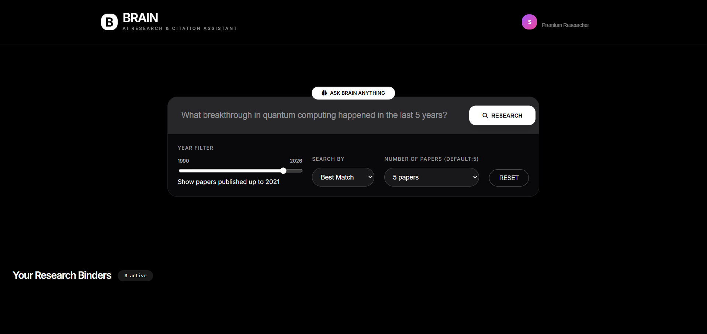
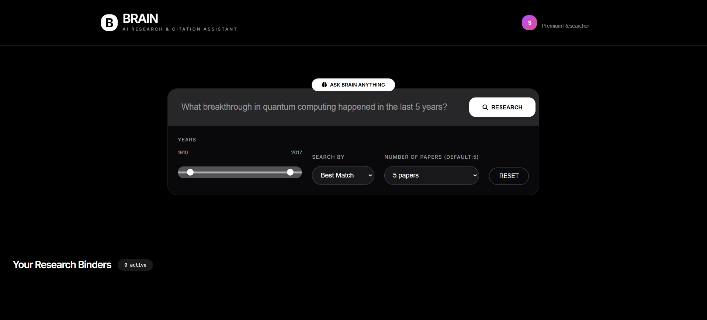
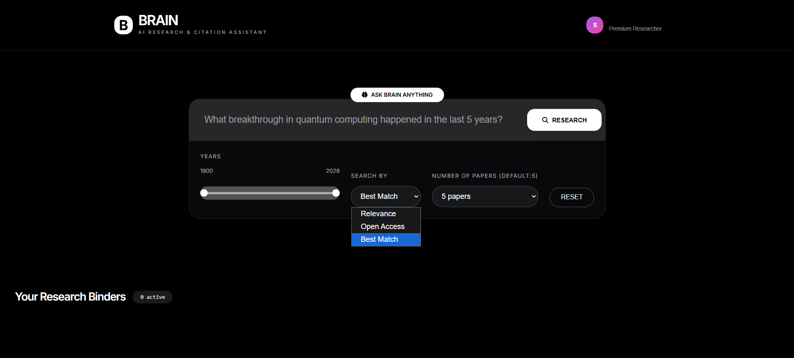
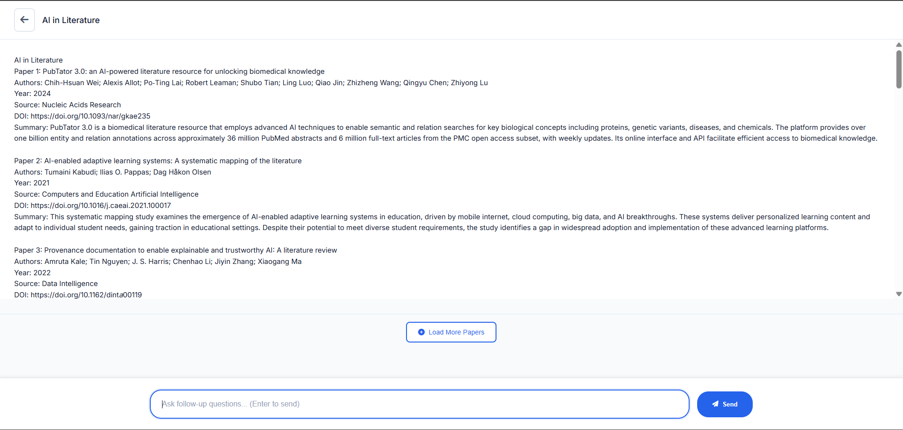
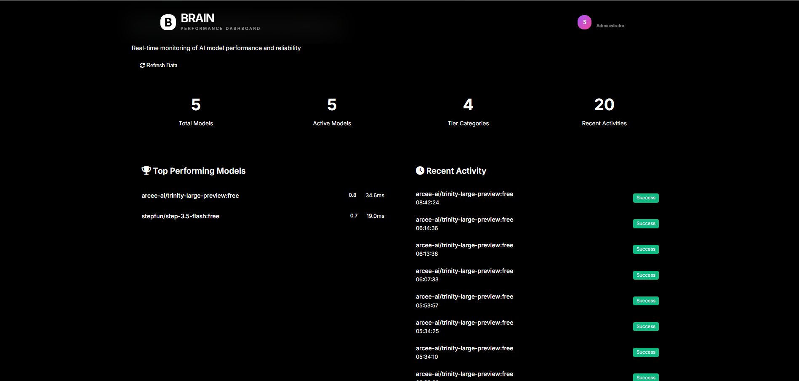

# AI Research Assistant

A comprehensive Django-based web application that serves as an AI-powered research assistant for academic papers. The application integrates with the OpenAlex API to search, retrieve, and process academic paper metadata, and uses OpenRouter's free LLM models to generate individual paper summaries with proper academic citations.

## Features

### Core Functionality

- **OpenAlex API Integration**: Full integration with OpenAlex API using pyalex library
- **OpenRouter LLM Integration**: Uses free models from OpenRouter to generate individual paper summaries with intelligent fallback
- **Performance Tracking System**: Comprehensive monitoring of model performance with reliability scoring
- **Intelligent Model Selection**: Automatic fallback to best-performing models based on success rates and response times
- **Paper Search Service**: Search academic papers with advanced filtering options (year range, open access status, random sampling)
- **Author Search Service**: Search for academic authors via OpenAlex API
- **Metadata Extraction**: Comprehensive extraction of paper metadata including title, authors, abstract, publication year, DOI, research concepts, and open access information
- **LLM Summarization**: Generate individual summaries for each paper with Harvard-style citations and 90%+ format compliance
- **Cursor-based Pagination**: Efficient pagination for large result sets using OpenAlex cursor API
- **Circuit Breaker Pattern**: Automatic disabling of consistently failing models
- **Real-time Analytics**: Admin dashboard with dedicated performance monitoring interface

## Performance Tracking System

The application includes a comprehensive performance tracking system for OpenRouter models:

### Key Features

- **Reliability Scoring**: Dynamic scoring (0.0-1.0) based on success rate, response time, recent activity, consecutive failures, and **format compliance (30% weight)**
- **Intelligent Fallback**: Models automatically tried in performance order, not randomly
- **Circuit Breaker Pattern**: Failing models automatically disabled after configurable thresholds
- **Real-time Monitoring**: Live dashboard with colored metrics and error analysis
- **Model Tiers**: Configurable tiers (Primary, Secondary, Emergency, Disabled)
- **Request Logging**: Detailed logging of every API request with error tracking
- **Format Compliance Tracking**: Automatic validation of required fields (Authors:, Year:, Source:, DOI:, Summary:, References:)

### Performance Metrics

- **Success Rate**: Percentage of successful requests per model
- **Response Time**: Average response time in milliseconds
- **Consecutive Failures**: Track failure streaks for circuit breaker
- **Reliability Score**: Weighted score combining multiple factors including **format compliance (30% weight)**
- **Format Compliance Score**: Percentage of responses that include all required fields
- **Error Analysis**: Common failure patterns and error messages

### Performance Dashboard

A dedicated admin interface for real-time monitoring of AI model performance:

- **Web Interface**: Accessible at `/admin/performance-dashboard/`
- **Live Statistics**: Total models, active models, tier categories, and recent activities
- **Top Performing Models**: Real-time ranking with reliability scores and response times
- **Recent Activity Log**: Success/failure tracking with timestamps
- **Tier Distribution**: Visual representation of model performance tiers
- **Auto-refresh**: Data automatically refreshes every 30 seconds
- **Modern UI**: Responsive design with dark theme and intuitive navigation

### Format Compliance System

The system automatically validates every LLM response for required academic formatting:

- **Required Fields**: `Authors:`, `Year:`, `Source:`, `DOI:`, `Summary:`, `References:`
- **Automatic Validation**: Built into performance tracker, runs on every successful request
- **Cumulative Scoring**: Tracks pass/fail rates over time
- **Database Integration**: Format compliance scores stored and used for model selection
- **Real-time Updates**: Admin panel shows live format compliance metrics

### Top Performing Models

Based on actual format compliance testing:

1. **arcee-ai/trinity-large-preview:free** - 71.4% format compliance, 0.695 reliability score
2. **stepfun/step-3.5-flash:free** - 0.0% format compliance, 0.600 reliability score
3. **google/gemma-3-4b-it:free** - 0.0% format compliance, 0.244 reliability score

### Frontend Features

- **Modern UI**: Clean, responsive web interface with dark theme
- **Interactive Research View**: Dynamic chat-like interface for research conversations
- **Binder System**: Save and organize research conversations with custom colors and titles
- **Paper Cards**: Visual display of research papers with metadata and links
- **Load More Functionality**: Seamless pagination for browsing large result sets
- **Real-time Search**: Instant search with loading indicators and error handling
- **Year Filter**: Single slider to filter papers by publication year (1900-2026)
- **Dynamic Tooltip**: Interactive year display when adjusting the filter

## Interface Screenshots

### Main Interface



### Year Filter Selection



### Filter Options



### Research Response View



### Performance Dashboard



## Technology Stack

### Backend

- **Framework**: Django 6.0+
- **API Client**: pyalex (OpenAlex Python client)
- **LLM Provider**: OpenRouter (free models with intelligent fallback)
- **Database**: SQLite (development), PostgreSQL (production ready)
- **Environment Management**: django-environ
- **Rate Limiting**: django-ratelimit
- **Performance Monitoring**: Custom performance tracking system with reliability scoring
- **Model Management**: Circuit breaker pattern and intelligent model selection

### Frontend

- **Template Engine**: Django Templates
- **CSS Framework**: Vanilla CSS
- **Icons**: FontAwesome 6.6.0
- **JavaScript**: Vanilla JavaScript with modern ES6+ features
- **Architecture**: Component-based with DOM management

### External APIs

- **OpenAlex**: Academic paper metadata and citation data
- **OpenRouter**: LLM models for paper summarization

## Project Structure

```
AIResearchAssistant/
├── README.md                           # This file
├── requirements.txt                    # Python dependencies
└── Research_Assistant/                 # Main Django project
    ├── manage.py                       # Django management script
    ├── test_api.py                     # API testing script
    ├── test_changes.py                 # Change verification script
    ├── summarise.py                    # LLM summarization test script
    ├── .env                            # Environment variables (create this)
    ├── Research_Assistant/             # Django project config
    │   ├── settings.py                 # Django settings
    │   └── urls.py                     # Root URL configuration
    └── Research_AI_Assistant/          # Main Django app
        ├── models.py                    # Database models
        ├── views.py                     # API views and endpoints
        ├── urls.py                      # App URL configuration
        ├── tests.py                     # Unit tests
        ├── templates/                   # HTML templates
        │   ├── index.html               # Main frontend template
        │   ├── images/                  # Interface screenshots
        │   │   ├── Interface.png
        │   │   ├── Filter 1.png
        │   │   ├── Filter 2.png
        │   │   ├── Response Page.png
        │   │   └── Performance_Dashboard.png
        │   └── admin/                   # Admin templates
        │       └── performance_dashboard.html  # Performance monitoring dashboard
        │   └── static/                  # Static assets
        │       ├── styles.css          # Main stylesheet
        │       └── scripts.js           # Frontend JavaScript
        └── services/                    # Business logic services
            ├── openalex_service.py      # OpenAlex API client
            ├── openrouter_service.py    # OpenRouter LLM client with performance tracking
            ├── extract_service.py       # Metadata extraction from OpenAlex
            ├── prompt_builder.py        # LLM prompt construction
            └── performance_tracker.py   # Model performance monitoring and intelligent fallback
```

## Installation & Setup

### Prerequisites

- Python 3.8+
- pip package manager
- Git (for cloning)

### Quick Start

1. **Clone the repository**:

   ```bash
   git clone https://github.com/your-username/AIResearchAssistant.git
   cd AIResearchAssistant
   cd Research_Assistant
   ```

2. **Create and activate virtual environment**:

   ```bash
   python -m venv venv
   venv\Scripts\activate  # Windows
   # source venv/bin/activate  # Mac/Linux
   ```

3. **Install dependencies**:

   ```bash
   pip install -r requirements.txt
   ```

4. **Configure environment variables**:
   Create a `.env` file with:

   ```env
   SECRET_KEY=your_django_secret_key_here
   OPENALEX_EMAIL=your_email@example.com
   OPENALEX_API_KEY=<"Your API key">
   OPENROUTER_API_KEY=sk-or-v1-xxxxxxxxxxxxxxxxxx
   OPENROUTER_SITE_URL=http://127.0.0.1:8080
   OPENROUTER_SITE_NAME=Research AI Assistant
   DEBUG=True
   ALLOWED_HOSTS=localhost,127.0.0.1
   ```

5. **Run database migrations**:

   ```bash
   python manage.py migrate
   ```

6. **Initialize model performance tracking**:

   ```bash
   python manage.py initialize_models
   ```

7. **Create superuser account**:

   ```bash
   python manage.py createsuperuser
   ```

8. **Start development server**:

   ```bash
   python manage.py runserver 8080
   ```

9. **Access the application**:
   - **Frontend**: `http://127.0.0.1:8080`
   - **Admin Dashboard**: `http://127.0.0.1:8080/admin/`
   - **API Documentation**: `http://127.0.0.1:8080/api/`

## Getting API Keys

### OpenAlex API Key

1. Visit [OpenAlex Settings](https://openalex.org/settings/api)
2. Sign in or create an account
3. Generate an API key
4. Copy the key and add to your `.env` file

### OpenRouter API Key

1. Visit [OpenRouter Dashboard](https://openrouter.ai/keys)
2. Sign up for a free account
3. Generate an API key
4. Copy the key and add to your `.env` file

## Testing

### API Testing

```bash
# Run all tests
python manage.py test Research_AI_Assistant.tests

# Test API endpoints
curl "http://127.0.0.1:8080/api/"
curl "http://127.0.0.1:8080/api/search/?q=machine+learning&per_page=5"
```

### Performance Testing

```bash
# Test OpenRouter models and performance tracking
python test_openrouter.py

# Test instruction consistency across models
python quick_consistency_test.py

# Test comprehensive model comparison
python test_consistency.py

# Test format compliance validation
python test_format_validation.py

# Test performance tracking system
python test_performance.py
```

### Admin Dashboard Testing

- Visit `http://127.0.0.1:8080/admin/`
- **Performance Dashboard**: Access `/admin/performance-dashboard/` for real-time monitoring
- Monitor model performance in "Model Performance" section
- View response logs and error patterns
- Configure model tiers and circuit breaker settings

## Security Features

- **Environment Variables**: All API keys stored in `.env` file
- **No Hardcoded Secrets**: Zero hardcoded API keys in codebase
- **Rate Limiting**: Proper rate limiting for OpenAlex (100 req/s) and OpenRouter (20 req/min)
- **CSRF Protection**: Django CSRF protection enabled
- **Input Validation**: Comprehensive parameter validation on all endpoints

## Troubleshooting

### Common Issues

1. **ModuleNotFoundError**: Ensure virtual environment is activated
2. **API Key Errors**: Verify `.env` file is in `Research_Assistant/` directory
3. **Port Already in Use**: Change port or kill existing process
4. **OpenRouter Model Errors**: System automatically falls back to other free models
5. **Admin Interface Errors**: Run `python manage.py initialize_models` to set up model tracking
6. **Performance Data Not Showing**: Check that requests are being made to generate tracking data

### Performance Monitoring

- **Model Reliability**: Check admin dashboard for success rates, response times, and format compliance
- **Circuit Breaker**: Models automatically disabled after consecutive failures
- **Format Compliance**: System tracks instruction following with 30% reliability weight
- **Best Performing Model**: `arcee-ai/trinity-large-preview:free` (71.4% format compliance, 0.695 reliability)
- **Data-Driven Selection**: Models chosen based on actual instruction-following performance

### API Endpoints for Monitoring

- **Performance Stats**: `GET /api/performance/stats/`
- **Model Details**: `GET /api/performance/model/?model_name=<model>`
- **Model Comparison**: `GET /api/performance/compare/?models=<model1,model2>`

## License

This project is licensed under the MIT License - see the [LICENSE](LICENSE) file for details.

### License Summary

- Commercial use allowed
- Modification allowed
- Distribution allowed
- Private use allowed
- Must include license and copyright notice
- No liability - software provided "as-is"

## Acknowledgments

### APIs & Data Sources

- [OpenAlex](https://openalex.org/) for comprehensive academic research database
- [OpenRouter](https://openrouter.ai/) for LLM API access and free models

### Frameworks & Libraries

- [Django](https://www.djangoproject.com/) (BSD 3-Clause) - Web framework
- [pyalex](https://github.com/J535D165/pyalex) (MIT) - OpenAlex Python client
- [django-environ](https://github.com/joke2k/django-environ) (MIT) - Environment variable management
- [django-ratelimit](https://github.com/jsocol/django-ratelimit) (BSD 3-Clause) - Rate limiting
- [requests](https://requests.readthedocs.io/) (Apache 2.0) - HTTP client library

### Frontend Assets

- [FontAwesome](https://fontawesome.com/) (CC BY 4.0) - Icons
- [TailwindCSS](https://tailwindcss.com/) (MIT) - CSS framework (used in design inspiration)

### Special Thanks

- OpenAlex community for maintaining comprehensive academic research database
- OpenRouter for providing free LLM models for research applications
- Django community for excellent documentation and framework
